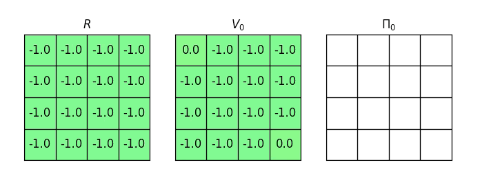

# Iterative RL
Implementation of iterative methods in [Reinforcement Learning](https://en.wikipedia.org/wiki/Reinforcement_learning), including Policy and Value Iteration.

#### Policy Iteration

<p align="center">
    
</p>


#### Value Iteration

<p align="center">
    
</p>


## Installation

To install the dependencies, run the following command:

```bash
pip install -r requirements.txt
```


## Usage

The current code uses `example1.txt` from `/examples`. To use another gridworld, change the path in `run.py`. Then, run the following command:

```bash
python iterative_RL filename goal
```

Check the different examples in `examples/`. Blocked states are represented by any character other than numbers. `goal` corresponds to the coordinates of the end state e.g. `0 0` for position (0, 0). For multiple goal states, concatenate the coordinates e.g.,  `0 0 3 3` for positions (0, 0) and (3, 3). For example, to visualize value iteration:

```bash
python iterative_RL examples/example1.txt 0 0 3 3 --method value
```

Additionally, you can change other parameters by adding the corresponding flag and value:

|      Flag      |                  Description                  | Default |
| :------------: | :-------------------------------------------: | :-----: |
|  -g, --gamma   |                Discount factor                |   0.9   |
|  _-h, --help_  | Displays information and flags of the program |    –    |
| -m, --_method_ |   Iterative method to find the best policy    | Policy  |
| _-t, --theta_  |  Convergence criteria for policy evaluation   |  0.001  |
| -v, --verbose  |             Prints run parameters             |  False  |

