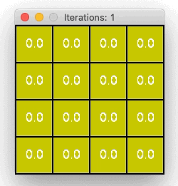

# Policy Evaluation
Iterative policy evaluation for gridworld using a random policy.

<p align="center">
    
</p>


## Installation

To install the dependencies, run the following command:

```bash
pip install -r requirements.txt
```


## Usage

The current code uses `example1.txt` from `/examples`. To use another gridworld, change the path in `run.py`. Then, run the following command:

```
python policy_evaluation/run.py
```

