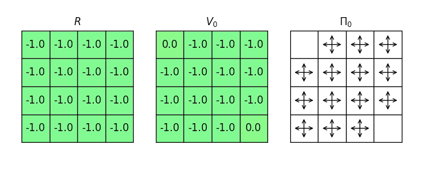

# Policy Iteration
Policy iteration for gridworld starting with a random policy.

<p align="center">
    
</p>


## Installation

To install the dependencies, run the following command:

```bash
pip install -r requirements.txt
```


## Usage

The current code uses `example1.txt` from `/examples`. To use another gridworld, change the path in `run.py`. Then, run the following command:

```
python policy_iteration/run.py filename goal
```

Where `filename` represents the path to a grid containing the rewards at each position e.g. `examples/example1.txt`, and `goal`, the coordinates of the end state e.g. `0 0` for position (0, 0). For multiple goal states, concatenate the coordinates e.g.,  `0 0 3 3` for positions (0, 0) and (3, 3):

```
python policy_iteration/run.py examples/example1.txt 0 0 3 3
```

Additionally, you can change other parameters by adding the corresponding flag and value:

|     Flag      |                  Description                  | Default |
| :-----------: | :-------------------------------------------: | :-----: |
|  -g, --gamma  |                Discount factor                |   0.9   |
| _-h, --help_  | Displays information and flags of the program |    –    |
| _-t, --theta_ |  Convergence criteria for policy evaluation   |  0.001  |
| -v, --verbose |             Prints run parameters             |  False  |

